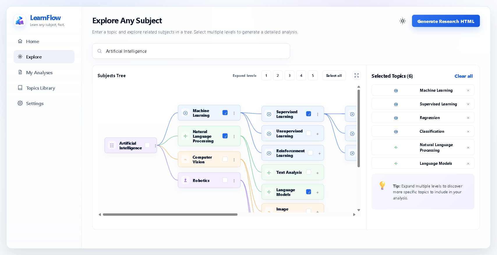
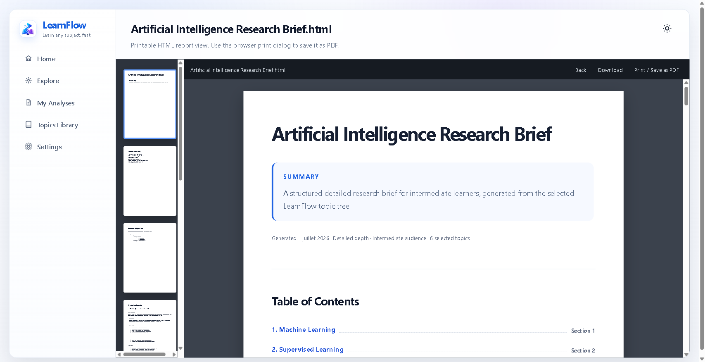

# LearnFlow


LearnFlow is a local MiniMax M3 powered learning app. It lets you enter any subject, expand a recursive topic tree, select the branches that matter, and generate a structured HTML research report that can be viewed in the app or printed to PDF.

Live site: [https://learnflow-sigma.vercel.app](https://learnflow-sigma.vercel.app)

The app is dependency-light on purpose: a native Node.js server/proxy, vanilla ES modules in the browser, and CSS for the app shell, report viewer, thumbnails, dark mode, and print layout.

## Screenshots





## Features

- MiniMax M3 subject exploration and research analysis through a server-side API proxy.
- Recursive topic tree with one-click "Expand levels" controls from 1 to 5.
- "Select all" for quickly selecting every currently loaded topic in the tree.
- Enter-to-search topic exploration, with searched topics saved into Topics Library.
- My Analyses recall for generated reports.
- A fullscreen subject-tree viewer for loaded branches.
- Light and dark modes with a visible sun icon in light mode and moon icon in dark mode.
- LearnFlow logo and favicon assets under `public/assets`.
- Research HTML generation from selected tree items, enriched with server-side web source snippets.
- A progressive generation modal with realistic percent updates while reports are being created.
- In-app report viewer with clickable thumbnails generated from the actual report sections.
- Continuous print-friendly report HTML with no forced page breaks.
- Downloaded HTML embeds the app report styles so it opens like the preview.
- Vercel serverless API functions under `api/` for production deployment.
- Tests for tree behavior, report rendering, MiniMax request handling, and server health.

## Quick Start

```bash
cp .env.example .env
# edit .env and set MINIMAX_API_KEY
npm start
```

Open the local URL printed by the server, usually:

```text
http://localhost:4173
```

## Environment

The browser never receives the API key. It calls local server routes, and the server reads the key from `.env`.

```text
MINIMAX_API_KEY=...
MINIMAX_BASE_URL=https://api.minimax.io/v1
MINIMAX_MODEL=MiniMax-M3
PORT=4173
```

## MiniMax Routes

The frontend calls:

```text
POST /api/explore
POST /api/analyze
```

The server forwards requests to:

```text
${MINIMAX_BASE_URL}/chat/completions
```

## Report Flow

Select topics in the tree, click `Generate Research HTML`, and LearnFlow opens the report viewer. Each selected section is written as a research brief with a simple definition, current details from collected web snippets, a longer overview, key takeaways, and sources consulted. The left rail shows previews generated from the actual report sections, and clicking a thumbnail jumps directly to that section. The `Print / Save as PDF` button opens the browser print dialog using a continuous HTML layout.

Generated reports are saved locally in `My Analyses`. Searched topic trees are saved locally in `Topics Library`, where they can be reopened later. Both use browser localStorage, so they are per-browser and per-device.

## Scripts

```bash
npm start       # run the local app server
npm run build   # copy client/server files into dist and validate required files
npm test        # run unit tests
npm run check   # syntax-check all main JS modules
npm run smoke   # start a temporary server and verify /health
```

## Vercel Deployment

This repo includes `.github/workflows/deploy-vercel.yml`. On every push to `main`, GitHub Actions runs checks/tests, builds the project with Vercel, and deploys the prebuilt output to production. The workflow also supports manual runs through `workflow_dispatch`.

Create a Vercel project for LearnFlow, set `MINIMAX_API_KEY` as a Vercel environment variable, then add these GitHub repository secrets:

```text
VERCEL_TOKEN
VERCEL_ORG_ID
VERCEL_PROJECT_ID
```

`vercel.json` uses `npm run build` and serves `dist` as the static output. The production AI routes are Vercel functions in `api/explore.mjs`, `api/analyze.mjs`, and `api/health.mjs`.

## Files

`public/index.html` is the app shell. `public/styles.css` contains the full visual system, dark mode, report viewer, thumbnails, modals, and print styles. `src/app.js` orchestrates UI screens, local recall, and interactions. `src/tree.js` owns the recursive tree model. `src/report.js` creates the printable report HTML. `server/index.mjs` serves static files and API routes locally. `server/research.mjs` collects public source snippets for selected topics. `server/minimax.mjs` handles MiniMax prompts, requests, parsing, and fallbacks. `api/` contains the Vercel production function routes.

## Production Notes

Before hosting publicly, add authentication, persistence for saved analyses, request logging, rate limits, and a deployment-time secret store for `MINIMAX_API_KEY`. The current app is intended for local testing and visual iteration.
